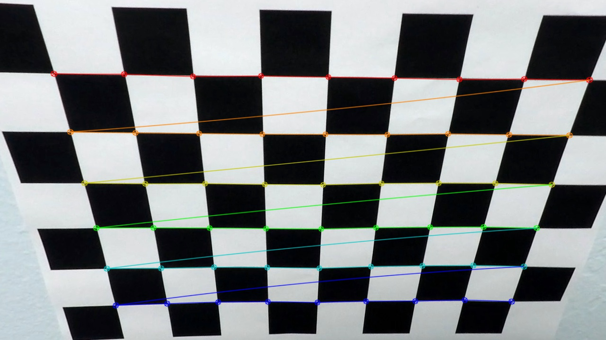
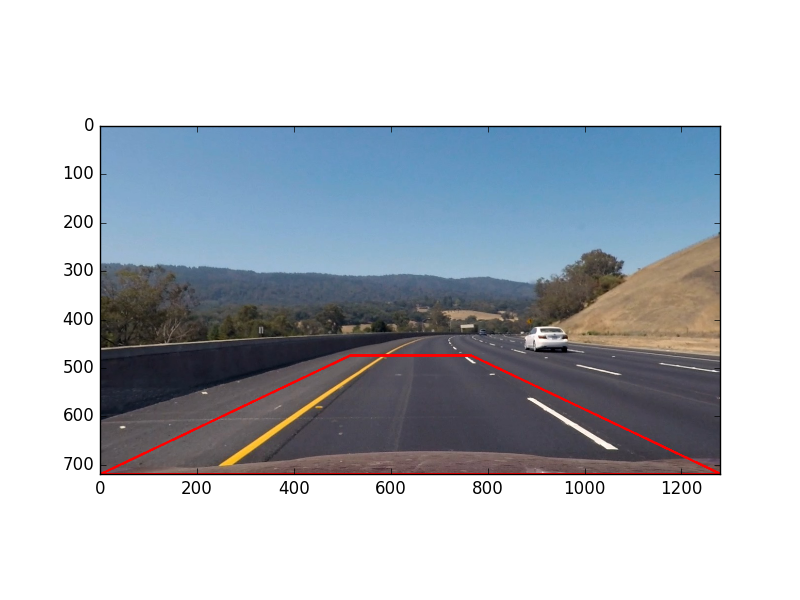
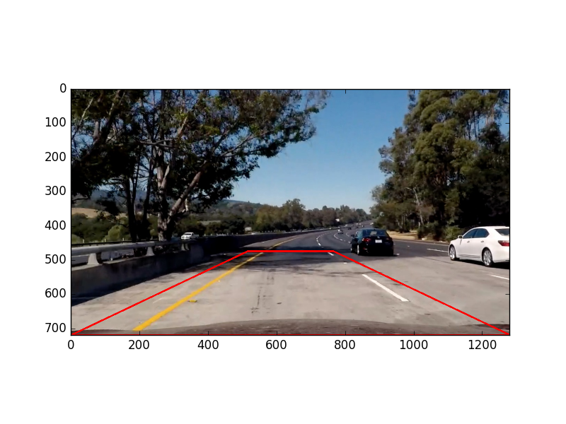
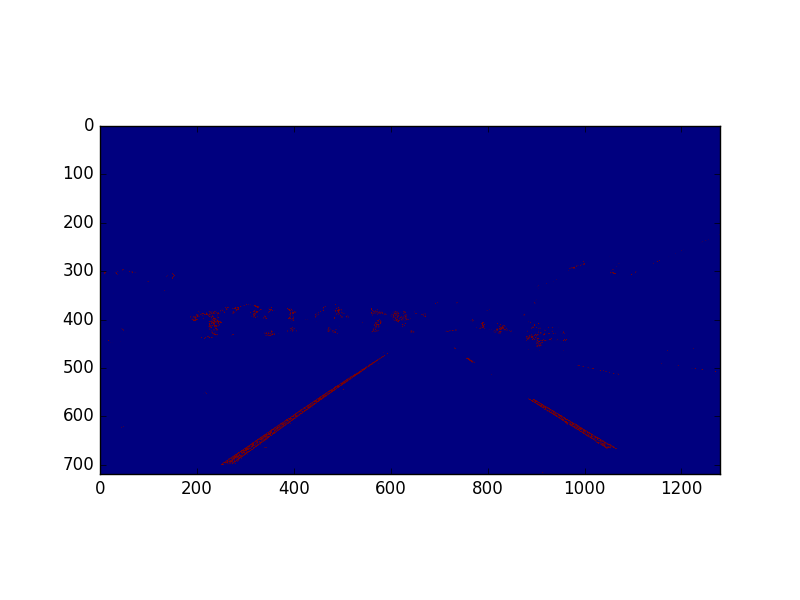
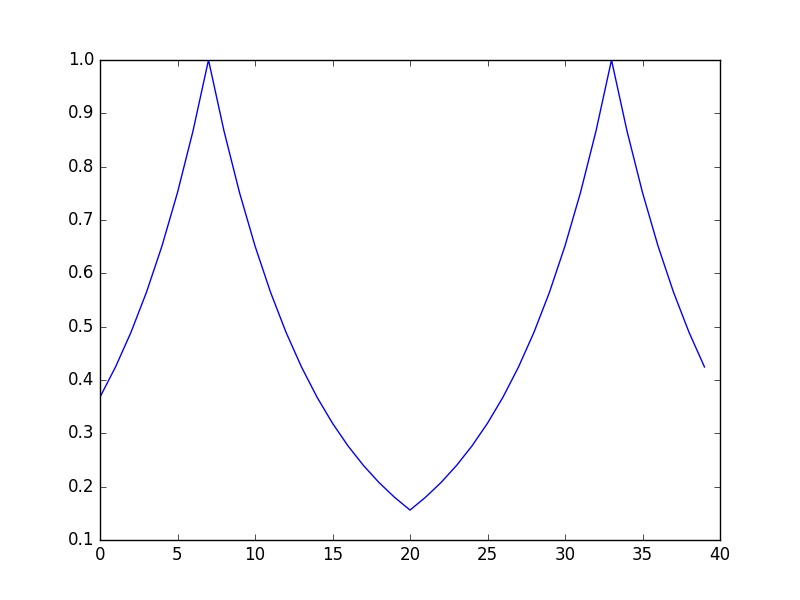
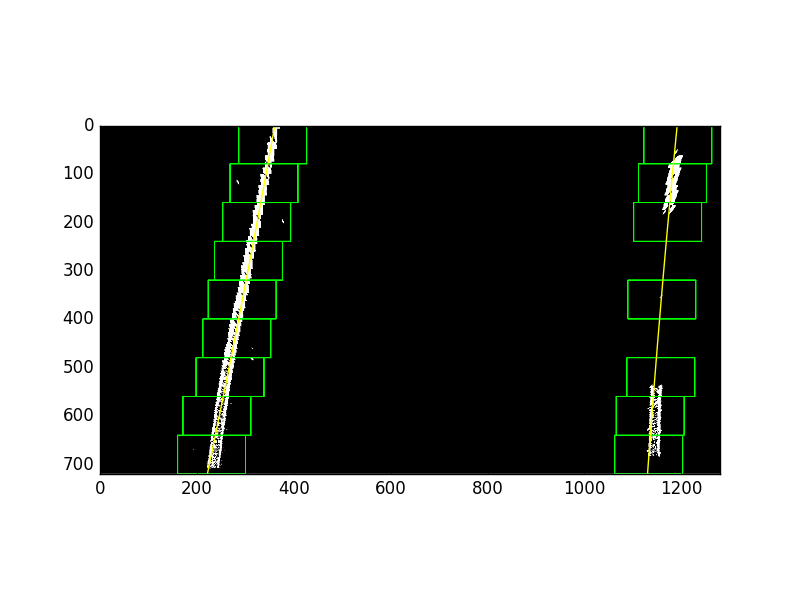
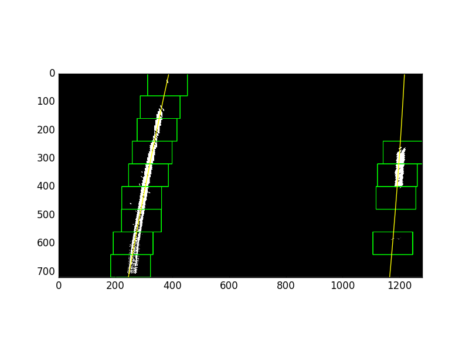
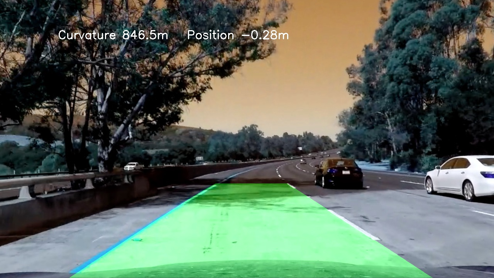

## Advanced Lane Finding
[](http://www.udacity.com/drive)  

Camera Calibration:
---
The camera calibration was performed using grey scaled images to gather distortion arrays for future use. 
If the calibration pickle is not provided, the calibration is performed again on lines 9:51 of project-4.py.
All but two of the images were successfully detected and all the images are stored in output_images folder 
with the detected corners drawn. 

The calibration parameters are stored onto calibration.p pickle file and then read out
during image processing, and used to correct the distortion, on line 85 of project-4.py.
Example chessboard distortion corrected image:



Example of undistorted image with the birdseye view corners drawn:



Colour Space Threshold
---

The undistorted images are then converted to the HLS colour space, and 4 value thresholds are combined 
to pick out useful pixels in the image using Red, Hue, Lightness and Saturation channels. 
These pixels then combined with the sobel filtered gradients within certain
directions to pick up the pixels of the lane lines. The code to do this step can be seen
on lines 87:125. An example of the binary image is shown below:


Warping to Birdseye View and Line detection
---

The binary image is then transformed using the following source and destination arrays:
```python
src = [[515., 475.], [765., 475.], [1280., 720.], [0., 720.]] 
dst = [[0., 0.], [1280., 0.], [1280., 720.], [0., 720.]]
```
The code for warping can be found on lines 127:158 and example images of these arrays are shown above.

At this stage the sum of the pixels from the bottom upto halfway + 100 pixels is taken
and an integral transform is performed with a mirrored lorentzian kernel to 
find which position best resembles lane lines. The code for this step is on lines 160:221. 
Below is the image of the kernel used:



If the new base position found is within 70 pixels of the last one, we will accept it as
the new base lane line position, and otherwise the centre of left and right sides is chosen.

Windows are chosen based on the current detected base line position and further integrals
are performed within the smaller windows, to further pinpoint the position of the lines.
. Since the centre of the windows are used as the points for plotting lane lines, the window position is unchanged upon an empty window or one that is outside the margin, and no point here is used for plotting.
In this case no points within that window are used for line fitting. 

If the next window is within a margin of the current recorded x position, successful
 detection indices are recognised and the line base line updated.
The relevant code is on lines
222:278 for this step. Example images below show how this step performs on test images:




Real value conversion and selection rules
---

After plotting a polynomial to the stored left and right indices, the
real life values of curvature are calculated by pixel per metre conversions, and if the curvature value for each side 
has not changed by more than 600m, it is stored as a valid reading. Only n
readings are stored, which is given to the Line() class upon initialization as an optional arguement. The polynomial fit parameters
and the curvature are both stored and averaged over the stored values to plot the detected
lane line overlay using a reverse warp. The code for this step is on lines 280:356

Car Centre Distance
---

The distance from the centre of the car from the centre of the lane lines, is calculated
by taking the lowest values of the new averaged fitted lines, and deducting the image centre
pixel position, assumed to be the centre of the car. This is performed on line 385

Reverse Warp
---

The reverse warp follows constructing a matrix of dst to src, in reverse order of the 
warp operation performed previously. The new average line parameters are used to draw the overlay
 on the original undistored image. The code for this step can be found on lines 370:381

If the left and right curvatures are below 100m, this is noted as an unreasonable value that
would lead to roughly above 15 degrees steering angle, and so will be ignored. Otherwise
a weighted average is used based on the number of windows that have successfully been detected
 on either side.

an example of an output image is shown below:



All output images are stored in the out_images folder for both calibration and other 
diagnostic images and final outputs.

Pipeline Video
---

The link to all videos can be found below:

[link to my video result](https://drive.google.com/open?id=0B8oLHWPlmk8iZzZzTEpTWUc1c2M)

[link to challenge video result](https://drive.google.com/open?id=0B8oLHWPlmk8iOXVObDl1bnVET1k)

[link to harder challenge video result](https://drive.google.com/open?id=0B8oLHWPlmk8iVjlMLWpZSjQ4bUU)

Discussion
---
The parameters of the kernel convolution, margin and selection criteria and colour thresholds were optimized for the test 
images and as such do not perform as well on new data that has different scaling and colours as well as much higher gradients.
There are several approaches I would like to pursue in challenging each. For instance a different kernel can be used based on
whichever performs best on the terrain at the time. The colour thresholds can be individually optimized for each gamma and
expanded to several more ranges and the overlay can be further optimized for different road and line sizes.