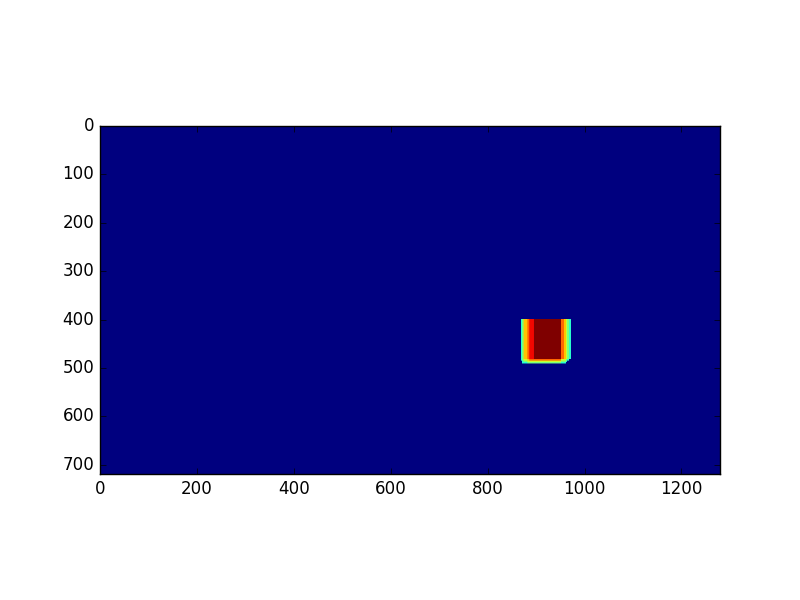
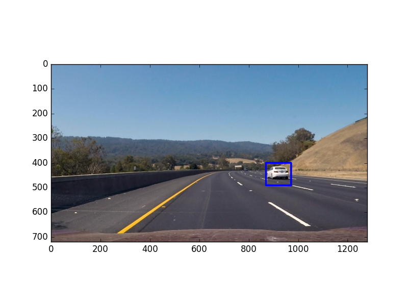
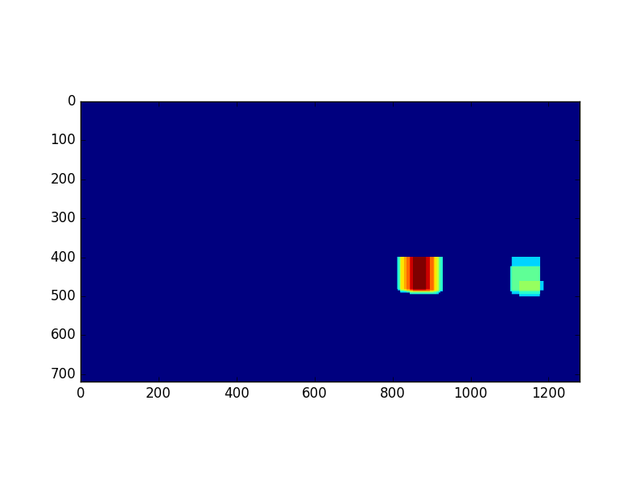
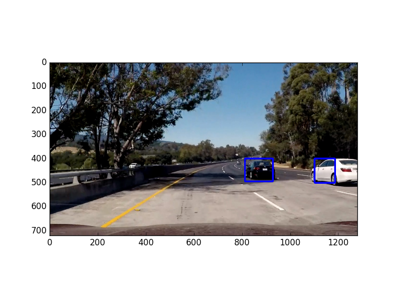

# Vehicle Detection

Prior to training, the data was processed using preprocess.py to eliminate duplicates or near zero images from the dataset. 
The smallest of the cars and noncars dataset sizes were used to present an even number of images in the training data. This is 
  followed by pickling the data as data.p for storage in future runs (this is provided in the submission)

Hog Feature extraction and Training:
---

Prior to feature extraction, the data is loaded and the extraction parameters are defined on lines 19:50 of project-5.py.
The parameters from the lessons were performing well and the only adjustments were to colour space to be 'HLS' and 
the hog channel set to use all three colours. This selection was made mainly due to cars appearing in more shiny and colourful
colours than the rest of the background. Next the extract_features() function from lesson_functions.py is 
executed, which is practically unchanged from the lessons. This function uses bin_features(), color_hist() and
get_hog_features() functions from the same file to extract direct resized image features, color histograms from a set 
number of bins, and gradient direction histograms from a set number of bins respectively. All the extracted features are
concatenated along a single axes and fed into a LinearSVC SVM classifier. The extract_features() code appears on lines 
48:89 of lesson_functions.py.

Lines 52:56 use a StandardScaler() to normalize the extracted features so as to reduce the effects of large values differences within 
the new extracted feature spaces. This step is performed before creating labels for the images, randomizing the data and
 splitting the data 8:2 to training and test sets (lines 58:64)
 
 The training of the classifier is on lines 66:79, along with general demonstration of the time of training and parameters 
 used (9 orientations 8 pixels per cell and 2 cells per block , Feature vector length: 6108). Since the accuracy was 
 near perfect on the predictions, the data was not normalized to further improve this, although this may have slightly 
 made the predictions more efficient.

Sliding window and visual tests
---

The process_image() function is designed to use the sliding window search from the lessons for video and image processing 
as well as diagnostic and parameter optimization (lines 91:151). Colour conversion first takes place, followed by 
initializing a heatmap to keep track of windows with detected cars inside them. The find_cars() function of the 
lesson_functions.py file is then run for all scaling factors (lines 159:226). This function first extracts hog_features
of the scaled image, and then slides through by the small step sizes within the image, performing all three functions
as per the extract_features() function during training. The simplification is that the same functions can now be run
 with different scaling, such that the extracted features are now of a different size window within the image.
 This is more efficient than extracting the hog_features for each overlapping image, although still not completely optimal.

Back to project-5.py, on lines 116:119, all the boxes are incremented on the heatmap, followed by averaging over previous 
n heatmaps (lines 123:127). The heatmap class is implemented on lines 82:88 of project-5.py and is only effective during
video processing. It drastically reduces false positives and allows a more reliable algorithm overall. The heatmap is 
thresholded after being averaged to improve false positive rejection, on line 130.

Since the accuracy of the data was in the 98-100% region, most of the classifier and extraction parameters were assumed
 accurate and unchanged for this section. Instead the focus  was on taking in all possible car image sizes and adjusting
 the scale factor to be able to find all the cars, while keeping the processing time as low as possible.

The output images are all stored in the output_images folder. Below are some example images of heatmaps and their 
respective boxes drawn using scipy's label function (lines 136:147):  

Video Pipeline and discussions
---

An averaging of the heatmap over 8 frames is introduced, as described previously, to eliminate false positives.
Find below the processed project video pipeline, as processed on lines 162:167

[link to my video result](processed_project_video.mp4)

Unfortunately the averaging also puts some parts of the cars to go below threshold and the boundaries to become less 
pronounced. This deterioration of the classification boundary can also be caused by the scale of the boundaries of the 
car which are no longer rectangular, even though our training is performed on exclusively rectangular images. So the sliding
 may have to account for rectangular window shapes.